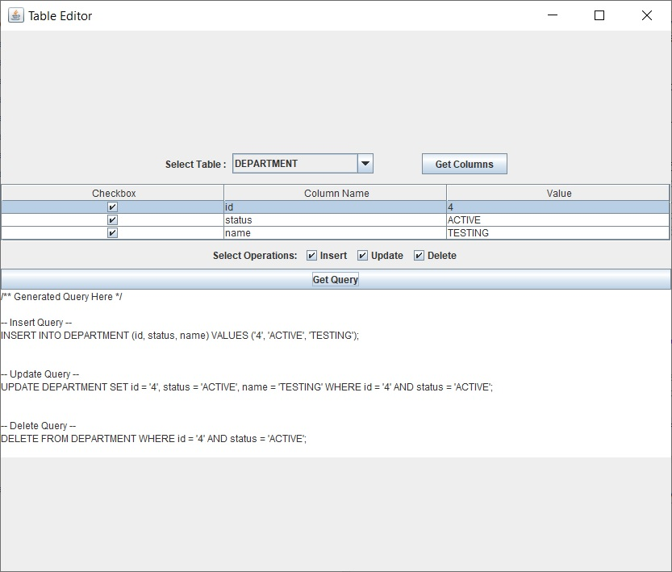

# **Table Editor**

A simple *Swing* based tool which generates SQL queries for the selected table, based on the selected operations - 
* Insert
* Update
* Delete

## **User Interface**

## **Steps to Use**
| Sr. No. | Steps | Result on Screen | Behind-the-scenes |
|---------|-------|------------------|-------------------|
|1.|Launch the application.|Landing page is displayed.|The application connects to the public schema in the locally installed PostgreSQL database.  All table names available in the database schema are populated in the "Select Table" dropdown.|
|2.|Select a table from list of available table names.|Table name is selected.|Table name is persisted for future operations.|
|3.|Click on "Get Columns" button.|Table is populated with column names of selected table.|The user selected table's columns are retrieved and populated in the table.|
|4.|Enter values for columns|The new user provided values are persisted.|The new value of each selected column is persisted for future operations.|
|5.|Choose the operation(s).|User selected operation checkbox is selected.|User selected operations are persisted for future operations.|
|6.|Click on "Get Query" button.|The text area is populated with queries.|SQL Queries for the user selected table are generated for the user selected operation(s). Only the checked column(s) participate in the queries.|

## **Technology Stack**
* Java
* Swing
* PostgreSQL database

## **Swing Components Used**
* JLabel
* JComboBox
* JButton
* JTable
* JCheckBox
* JTextArea

## **Supported Database(s)**
* Only PostgreSQL database is supported at the moment.